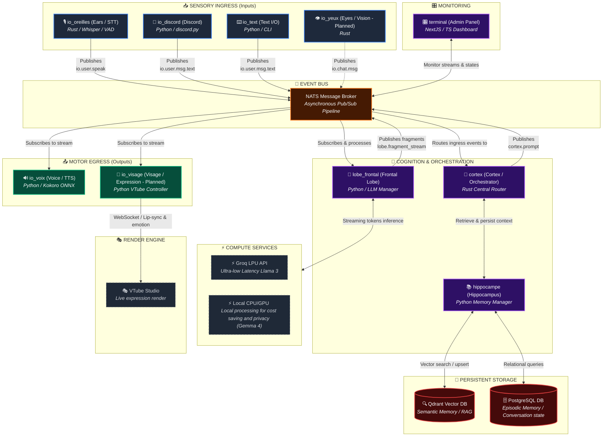

# Project Aletheia
An Edge-Native Asynchronous Multimodal Orchestration Pipeline

Aletheia is an autonomous, proactive and persistent virtual entity capable of interacting with the world through multiple modalities (text, voice, vision). She is a VTuber and can interact with users through various platforms such as Discord, Twitch, and YouTube.
Because she is a virtual entity interacting with humans online, she must be able to :
- hear (STT)
- see (Computer Vision)
- think (Large Language Model)
- remember (memory)
- speak (TTS)
- emote (expressions)
And all of this should be on a real-time basis with high performance and low latency. This is a hard requirement, especially on a consumer PC hardware.

In terms of performance goals, we want to achieve : a time to speech under 300ms from the moment the user stops speaking (for a continuous stream of speech). The LLM should generate its first sentence in under 200ms to let the TTS engine start speaking with minimal delay.

## Features

- Multimodal input (audio, text, video)
- Multimodal output (audio, text, video)
- Can use remote LLM (Groq) or local LLM (Gemma 4)
- Real-time processing
- Low latency (< 300ms time to first response)
- Persistent memory
- Edge-native (can run on consumer hardware, more details below)
- Asynchronous
- Higly monitored (dashboard, logs, metrics)
- Proactive and autonomous

## Architecture

To achieve such performance goals, we will use a microservices architecture based on Rust for the orchestration layer and Python for the AI layer. The microservices will communicate with each other using NATS on an event bus. The database will be a PostgreSQL database with Qdrant for vector storage. Microservices are made to mimic the human brain.

The microservices are:
- **cortex** (directory: `services/cortex`): the orchestration layer written in Rust.
- **frontal_lobe** (directory: `services/lobe_frontal`): the LLM layer written in Python.
- **hippocampus** (directory: `services/hippocampe`): the memory layer written in Python.
- **ears** (directory: `services/io_oreilles`): the STT layer written in Rust.
- **voice** (directory: `services/io_voix`): the TTS layer written in Python.
- **discord** (directory: `services/io_discord`): the Discord integration layer used by humans to chat with Aletheia during the development process, written in Python.
- **text** (directory: `services/io_text`): the direct terminal text interaction layer written in Python.
- **eyes** (directory: `services/io_yeux` - not fully implemented yet): the computer vision layer written in Rust.
- **visage** (directory: `services/io_visage` - not fully implemented yet): the VTuber model integration layer written in Python.
- **terminal** (directory: `services/terminal` - not fully implemented yet): the terminal dashboard used to monitor, debug, and interact with microservices, written in NextJS and TypeScript.
- **twitch** & **youtube** (planned): integration layers for streaming platforms.

Those microservices work as follows:


## How to run Aletheia

### Prerequisites
- Docker
- Docker Compose
- Rust >= 2024
- Python >= 3.12

### Steps
1. Clone the repository:
```bash
git clone git@github.com:MiloBonbaril/Aletheia-V3.git
```
2. Navigate to the project directory:
```bash
cd Aletheia-V3
```
3. Run the event bus:
```bash
docker compose up -d
```
4. Run any microservice you want (the cortex must run to orchestrate everything):
```bash
cd services/<service-name>
python main.py
# or (for rust based services)
cargo run
```

### How to stop Aletheia
kill every service and docker containers:
```bash
docker compose down
```

## Benchmarks

Coming soon !

