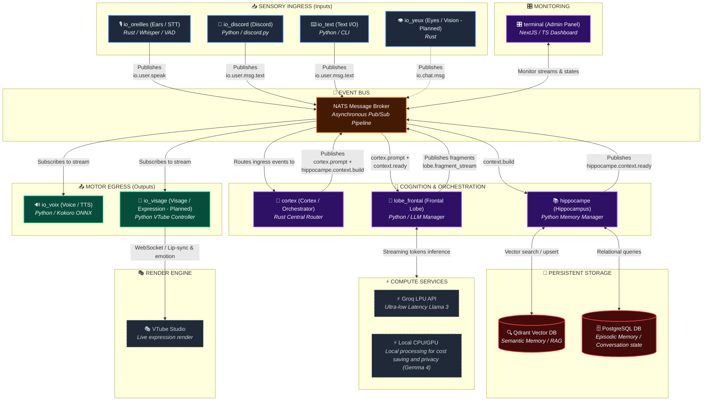

# Project Aletheia
An Edge-Native Asynchronous Multimodal Orchestration Pipeline

Aletheia is an autonomous, proactive and persistent virtual entity capable of interacting with the world through multiple modalities (text, voice, vision). She is a VTuber and can interact with users through various platforms such as Discord, Twitch, and YouTube.
Because she is a virtual entity interacting with humans online, she must be able to :
- hear (STT)
- see (Computer Vision)
- think (Large Language Model)
- remember (memory)
- speak (TTS)
- emote (expressions)
And all of this should be on a real-time basis with high performance and low latency. This is a hard requirement, especially on a consumer PC hardware.

In terms of performance goals, we want to achieve : a time to speech under 300ms from the moment the user stops speaking (for a continuous stream of speech). The LLM should generate its first sentence in under 200ms to let the TTS engine start speaking with minimal delay.

## Features

- Multimodal input (audio, text, video)
- Multimodal output (audio, text, video)
- Can use remote LLM (Groq) or local LLM (Gemma 4)
- Real-time processing
- Low latency (< 300ms time to first response)
- Persistent memory
- Edge-native (can run on consumer hardware, more details below)
- Asynchronous
- Higly monitored (dashboard, logs, metrics)
- Proactive and autonomous

## Architecture

To achieve such performance goals, we will use a microservices architecture based on Rust for the orchestration layer and Python for the AI layer. The microservices will communicate with each other using NATS on an event bus. The database will be a PostgreSQL database with Qdrant for vector storage. Microservices are made to mimic the human brain.

The microservices are:
- **cortex** (directory: `services/cortex`): the orchestration layer written in Rust.
- **frontal_lobe** (directory: `services/lobe_frontal`): the LLM layer written in Python.
- **hippocampus** (directory: `services/hippocampe`): the memory layer written in Python.
- **ears** (directory: `services/io_oreilles`): the STT layer written in Rust.
- **voice** (directory: `services/io_voix`): the TTS layer written in Python.
- **discord** (directory: `services/io_discord`): the Discord integration layer used by humans to chat with Aletheia during the development process, written in Python.
- **text** (directory: `services/io_text`): the direct terminal text interaction layer written in Python.
- **eyes** (directory: `services/io_yeux` - not fully implemented yet): the computer vision layer written in Rust.
- **visage** (directory: `services/io_visage` - not fully implemented yet): the VTuber model integration layer written in Python.
- **terminal** (directory: `services/terminal` - not fully implemented yet): the terminal dashboard used to monitor, debug, and interact with microservices, written in NextJS and TypeScript.
- **twitch** & **youtube** (planned): integration layers for streaming platforms.

Those microservices work as follows:


## How to run Aletheia

### Prerequisites
- Docker
- Docker Compose
- Rust >= 2024
- Python >= 3.12

### Steps
1. Clone the repository:
```bash
git clone git@github.com:MiloBonbaril/Aletheia-V3.git
```
2. Navigate to the project directory:
```bash
cd Aletheia-V3
```
3. Run the event bus:
```bash
docker compose up -d
```
4. Run any microservice you want (the cortex must run to orchestrate everything):
```bash
cd services/<service-name>
python main.py
# or (for rust based services)
cargo run
```

### How to stop Aletheia
kill every service and docker containers:
```bash
docker compose down
```

## Benchmarks

### Hardware used for benchmarks:
Laptop running the entire project:
- Processor: AMD Ryzen 5 5500U
- Graphics Card: integrated AMD Radeon Graphics
- RAM: 16 GB
- SSD: 512 GB
- OS: Arch Linux
- Wi-Fi

Desktop PC running the local LLM (Gemma 4 E2B) via llama.cpp:
- Processor: AMD Ryzen 9 5950X
- Graphics Card: NVIDIA RTX 5070ti (16 GB)
- RAM: 32 GB (DDR4)
- SSD: 512 GB
- OS: Windows 11
- Wi-Fi

### Benchmark Results

The `benchmark` service is located in the `services/benchmark` directory and is used to benchmark Aletheia continuously and automatically, ensuring performance requirements are met.

#### V1.0 First benchmark implementation

Here are the E2E benchmark results:
```
🚀 [NOUVEAU FLUX DÉTECTÉ] sur io.user.msg.text
  ▶ Entrée Utilisateur (io.user.msg.text) | Latence absolue: 0 µs
  ▶ Aiguillage Cortex (cortex.prompt) | Latence absolue: 8.6 ms
  ▶ Premier Fragment (TTFT) (lobe.fragment_stream) | Latence absolue: 3.13 s
  ▶ Dernier Fragment LLM (lobe.fragment_stream) | Latence absolue: 3.30 s
  ▶ Début Lecture Voix (io.voice.speak.start) | Latence absolue: 4.68 s
  ▶ Fin Lecture Voix (io.voice.speak.end) | Latence absolue: 11.71 s
```

Thus, we can observe that:
1. The LLM receives the message in 8.6 ms, which is impressive.
2. The LLM starts generating tokens in 3.12 s, which is quite high and needs to be reduced.
3. The TTS finishes its first synthesis in 1.55 s, resulting in a total of 4.68 s after the user's message is sent.
4. The LLM finishes its generation before the TTS finishes reading the first fragment.

A latency of 4.68 s is long for a real-time conversation; this needs to be reduced. However, for a first test on such hardware, it is quite promising!

The next goal is to reduce the LLM latency for the TTFT to under 2 seconds, and reduce the TTS synthesis time to under 1 second. This would give us a total latency of less than 3 seconds.

#### V1.1 TTS Optimization

After redesigning the TTS and allowing the models to warm up, we obtain the following results:
```
🚀 [NOUVEAU FLUX DÉTECTÉ] sur io.user.msg.text
  ▶ Entrée Utilisateur (io.user.msg.text) | Latence absolue: 0 µs
  ▶ Aiguillage Cortex (cortex.prompt) | Latence absolue: 10.0 ms
  ▶ Premier Fragment (TTFT) (lobe.fragment_stream) | Latence absolue: 505.5 ms
  ▶ Dernier Fragment LLM (lobe.fragment_stream) | Latence absolue: 633.6 ms
  ▶ Début Lecture Voix (io.voice.speak.start) | Latence absolue: 1.03 s
  ▶ Fin Lecture Voix (io.voice.speak.end) | Latence absolue: 10.40 s
```
The "time to first audio" is reduced to 1 second, which is perfectly acceptable for a real-time conversation.

However, the "time to first token" does not seem to be stable, as shown by this result:
```
🚀 [NOUVEAU FLUX DÉTECTÉ] sur io.user.msg.text
  ▶ Entrée Utilisateur (io.user.msg.text) | Latence absolue: 0 µs
  ▶ Aiguillage Cortex (cortex.prompt) | Latence absolue: 1.8 ms
  ▶ Premier Fragment (TTFT) (lobe.fragment_stream) | Latence absolue: 2.11 s
  # no last fragment because the message was "OK" (which means only one token, and should be fast)
  ▶ Début Lecture Voix (io.voice.speak.start) | Latence absolue: 2.40 s
  ▶ Fin Lecture Voix (io.voice.speak.end) | Latence absolue: 2.96 s
```

This final result still shows that the TTS latency dropped below 290.4 ms, which is excellent. However, there is an issue with the LLM, which is neither stable nor fast enough.


### V1.2 LLM Optimization

After redesigning the LLM part we obtained the following results:
```
🚀 [NOUVEAU FLUX DÉTECTÉ] sur io.user.msg.text
  ▶ Entrée Utilisateur (io.user.msg.text) | Latence absolue: 0 µs
  ▶ Aiguillage Cortex (cortex.prompt) | Latence absolue: 6.9 ms
  ▶ Premier Fragment (TTFT) (lobe.fragment_stream) | Latence absolue: 832.6 ms
  ▶ Dernier Fragment LLM (lobe.fragment_stream) | Latence absolue: 875.4 ms
  ▶ Début Lecture Voix (io.voice.speak.start) | Latence absolue: 3.11 s
  ▶ Fin Lecture Voix (io.voice.speak.end) | Latence absolue: 10.36 s
```
and:
```
🚀 [NOUVEAU FLUX DÉTECTÉ] sur io.user.msg.text
  ▶ Entrée Utilisateur (io.user.msg.text) | Latence absolue: 0 µs
  ▶ Aiguillage Cortex (cortex.prompt) | Latence absolue: 1.4 ms
  ▶ Premier Fragment (TTFT) (lobe.fragment_stream) | Latence absolue: 424.8 ms
  # "sprint test" only generating "OK"
  ▶ Début Lecture Voix (io.voice.speak.start) | Latence absolue: 744.3 ms
  ▶ Fin Lecture Voix (io.voice.speak.end) | Latence absolue: 1.31 s
```

This results shows great improvements, with the "time to first token" dropping to 424.8 ms, and "time to first audio" dropping to 744.3 ms, which is excellent for a real-time conversation.
This also shows that the TTFT is much more stable now, the difference between the two results is mainly due to the fact that "sprint test" is a very short message that only generate "OK".
