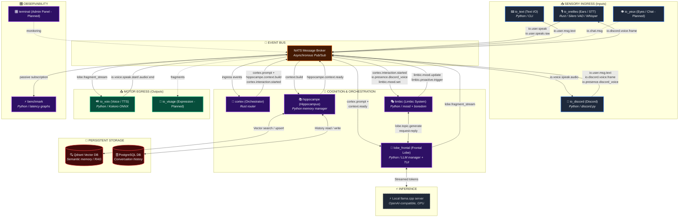

# Project Aletheia

An edge-native, asynchronous, multimodal orchestration pipeline.

Aletheia (internal codename "Nexus-V") is an autonomous virtual entity (a VTuber). She interacts
with users on Discord, and later on Twitch and YouTube. She must:

- hear (speech-to-text)
- see (computer vision)
- think (a large language model)
- remember (episodic and semantic memory)
- speak (text-to-speech)
- show emotions (avatar expressions)

The system does all of these tasks in real time on consumer hardware.

## Performance targets

| Metric | Target |
|---|---|
| Time to first audio, after the user stops to speak | less than 300 ms |
| Time to first token from the LLM | less than 200 ms |

Measure each change that can have an effect on latency. Use the `benchmark` service. Do not
measure by hand.

## Status

| Service | Directory | Language | Status |
|---|---|---|---|
| cortex (orchestrator) | `services/cortex` | Rust | Operational |
| lobe_frontal (LLM engine) | `services/lobe_frontal` | Python | Operational |
| hippocampe (memory) | `services/hippocampe` | Python | Operational |
| limbic (mood and proactivity) | `services/limbic` | Python | Operational |
| io_oreilles (ears, STT) | `services/io_oreilles` | Rust | Operational |
| io_voix (voice, TTS) | `services/io_voix` | Python | Operational |
| io_discord (Discord gateway) | `services/io_discord` | Python | Operational |
| io_text (terminal input) | `services/io_text` | Python | Operational |
| benchmark (latency harness) | `services/benchmark` | Python | Operational |
| io_yeux (eyes, chat aggregation) | `services/io_yeux` | — | Specification only |
| io_visage (VTube Studio control) | `services/io_visage` | — | Specification only |
| terminal (admin dashboard) | `services/terminal` | — | Specification only |

The three last services contain a README file only. They have no source code.

## Architecture

The system is a set of microservices. Rust does the orchestration and the audio capture. Python
does the AI work. The services communicate only through the **NATS** event bus. There is no direct
call between two services. Each service starts, stops and fails independently.

The LLM inference runs on a local **llama.cpp** server (see `docs/adr/0002-lobe-frontal-stays-llama-cpp-only.md`).
The `Groq/` and `Mistral/` interfaces in `lobe_frontal` are not connected. Do not remove them, and
do not connect them.

Two reference documents give the details:

- [`NATS_TOPICS.md`](NATS_TOPICS.md) — all topics, payloads and message flows.
- [`PROMPTING.md`](PROMPTING.md) — the XML schema of the system prompt.


```mermaid
flowchart TB
    %% Styling definitions
    classDef ingress fill:#1e293b,stroke:#3b82f6,stroke-width:2px,color:#f8fafc;
    classDef core fill:#2e1065,stroke:#a855f7,stroke-width:2px,color:#f8fafc;
    classDef egress fill:#064e3b,stroke:#10b981,stroke-width:2px,color:#f8fafc;
    classDef broker fill:#451a03,stroke:#f97316,stroke-width:2px,color:#f8fafc;
    classDef database fill:#450a0a,stroke:#ef4444,stroke-width:2px,color:#f8fafc;
    classDef external fill:#1f2937,stroke:#6b7280,stroke-width:1px,color:#d1d5db,stroke-dasharray: 5 5;

    subgraph Sensory_Ingress ["📥 SENSORY INGRESS (Inputs)"]
        direction LR
        oreilles["🎙️ io_oreilles (Ears / STT)<br/><i>Rust / Silero VAD / Whisper</i>"]:::ingress
        discord["💬 io_discord (Discord)<br/><i>Python / discord.py</i>"]:::ingress
        text_io["⌨️ io_text (Text I/O)<br/><i>Python / CLI</i>"]:::ingress
        yeux["👁️ io_yeux (Eyes / Chat - Planned)"]:::ingress
    end

    subgraph Event_Broker ["📡 EVENT BUS"]
        nats["NATS Message Broker<br/><i>Asynchronous Pub/Sub</i>"]:::broker
    end

    subgraph Cognition ["🧠 COGNITION & ORCHESTRATION"]
        cortex["🧠 cortex (Orchestrator)<br/><i>Rust router</i>"]:::core
        lobe["💬 lobe_frontal (Frontal Lobe)<br/><i>Python / LLM manager + TUI</i>"]:::core
        hippocampe["📚 hippocampe (Hippocampus)<br/><i>Python memory manager</i>"]:::core
        limbic["🎭 limbic (Limbic System)<br/><i>Python / mood + boredom</i>"]:::core
    end

    subgraph Storage ["💾 PERSISTENT STORAGE"]
        qdrant[("🔍 Qdrant Vector DB<br/><i>Semantic memory / RAG</i>")]:::database
        postgres[("🗄️ PostgreSQL DB<br/><i>Conversation history</i>")]:::database
    end

    subgraph Compute_API ["⚡ INFERENCE"]
        local["⚡ Local llama.cpp server<br/><i>OpenAI-compatible, GPU</i>"]:::external
    end

    subgraph Motor_Egress ["📤 MOTOR EGRESS (Outputs)"]
        direction LR
        voix["🔊 io_voix (Voice / TTS)<br/><i>Python / Kokoro ONNX</i>"]:::egress
        visage["👤 io_visage (Expression - Planned)"]:::egress
    end

    subgraph Observability ["🎛️ OBSERVABILITY"]
        bench["⚡ benchmark<br/><i>Python / latency graphs</i>"]:::core
        terminal["🎛️ terminal (Admin Panel - Planned)"]:::core
    end

    %% Ingress
    oreilles -->|io.user.speak<br/>io.user.speak.raw| nats
    discord -->|io.user.msg.text<br/>io.discord.voice.frame<br/>io.presence.discord_voice| nats
    text_io -->|io.user.msg.text| nats
    yeux -.->|io.chat.msg| nats

    nats -->|ingress events| cortex
    nats -->|io.discord.voice.frame| oreilles

    %% Cognition
    cortex -->|cortex.prompt +<br/>hippocampe.context.build<br/>cortex.interaction.started| nats
    nats -->|context.build| hippocampe
    hippocampe <-->|Vector search / upsert| qdrant
    hippocampe <-->|History read / write| postgres
    hippocampe -->|hippocampe.context.ready| nats

    nats -->|cortex.prompt +<br/>context.ready| lobe
    lobe <-->|Streamed tokens| Compute_API
    lobe -->|lobe.fragment_stream| nats

    %% Limbic loop
    nats -->|cortex.interaction.started<br/>io.presence.discord_voice<br/>limbic.mood.set| limbic
    limbic -->|limbic.mood.update<br/>limbic.proactive.trigger| nats
    limbic <-->|lobe.topic.generate<br/>request-reply| lobe

    %% Egress
    nats -->|lobe.fragment_stream| voix
    voix -->|io.voice.speak.start/.audio/.end| nats
    nats -->|io.voice.speak.audio| discord
    nats -.->|fragments| visage

    %% Observability
    nats -->|passive subscription| bench
    terminal -.->|monitoring| nats
```

## Message flow

A user message causes this sequence:

1. An I/O service publishes the message on an ingress topic.
2. The cortex dispatches `cortex.prompt` and `hippocampe.context.build` in parallel.
3. The hippocampe reads the history and the RAG memory in parallel, then publishes
   `hippocampe.context.ready`.
4. The lobe_frontal waits for the context, then starts the inference.
5. The lobe_frontal cuts the answer at punctuation marks. It publishes each fragment on
   `lobe.fragment_stream`.
6. The io_voix service speaks each fragment. The io_discord service sends the same text and audio
   to Discord.

## How to run Aletheia

### Prerequisites

- Docker and Docker Compose
- Rust (edition 2021 and 2024)
- Python 3.12 or higher
- A local llama.cpp server for the LLM inference
- `ffmpeg` on the PATH, for the Discord voice functions

### Steps

1. Clone the repository:
   ```bash
   git clone git@github.com:MiloBonbaril/Aletheia-V3.git
   cd Aletheia-V3
   ```
2. Start the event bus:
   ```bash
   docker compose up -d          # NATS: 4222 (clients), 8222 (monitoring)
   ```
3. Start the datastores of the hippocampe:
   ```bash
   cd services/hippocampe && docker compose up -d   # PostgreSQL 5432, Qdrant 6333/6334
   ```
4. Start each service that you need. The cortex is always necessary.
   ```bash
   cd services/<name>
   pip install -r requirements.txt && python main.py   # Python services
   cargo run --release                                 # Rust services
   ```

Each service has its own `requirements.txt` or `Cargo.toml`. There is no shared build system and no
shared virtual environment.

### How to stop Aletheia

Stop each service, then stop the containers:

```bash
docker compose down
```

## Tests

There is no repository-level test runner. Some services have their own tests:

```bash
cd services/<name> && pytest tests/     # io_discord, io_voix, limbic, lobe_frontal, hippocampe
cd services/cortex && cargo test        # cortex
```

## Benchmarks

The `benchmark` service subscribes to NATS and reconstructs the full life cycle of a message. Use it
to measure the effect of a change on the latency.

```bash
cd services/benchmark
pip install -r requirements.txt
python main.py                          # default graph: graphs/E2E.json
python main.py graphs/T2T.json          # text-to-text only
```

### Hardware used for the measurements

Desktop computer that runs the pipeline, the local LLM and the STT:

- CPU: AMD Ryzen 9 5950X
- GPU: NVIDIA RTX 5070 Ti (16 GB)
- RAM: 32 GB DDR4
- OS: Arch Linux, Wi-Fi connection

### Speech-to-text (io_oreilles)

The measurement uses 28 real segments (61.9 s of audio) and the `whisper-small` model.

| Device | Median | p90 | Max | Real-time factor |
|---|---|---|---|---|
| CPU (OpenBLAS, 16 threads) | 10038 ms | 12935 ms | 20123 ms | 4.64× |
| GPU (CUDA) | **97 ms** | 117 ms | 180 ms | **0.042×** |

The CPU is 4.6 times slower than real time. Thus the GPU is not an option, it is a condition to use
the voice mode. See `services/io_oreilles/README.md`.

### End-to-end history

These results come from the successive optimization steps of the pipeline. The service prints the
labels in French.

#### V1.0 — first implementation

```
  ▶ Entrée Utilisateur (io.user.msg.text) | Latence absolue: 0 µs
  ▶ Aiguillage Cortex (cortex.prompt) | Latence absolue: 8.6 ms
  ▶ Premier Fragment (TTFT) (lobe.fragment_stream) | Latence absolue: 3.13 s
  ▶ Dernier Fragment LLM (lobe.fragment_stream) | Latence absolue: 3.30 s
  ▶ Début Lecture Voix (io.voice.speak.start) | Latence absolue: 4.68 s
  ▶ Fin Lecture Voix (io.voice.speak.end) | Latence absolue: 11.71 s
```

The cortex routed the message in 8.6 ms. The LLM was too slow: 3.13 s before the first token. The
total time to first audio was 4.68 s.

#### V1.1 — TTS optimization

```
  ▶ Aiguillage Cortex (cortex.prompt) | Latence absolue: 10.0 ms
  ▶ Premier Fragment (TTFT) (lobe.fragment_stream) | Latence absolue: 505.5 ms
  ▶ Début Lecture Voix (io.voice.speak.start) | Latence absolue: 1.03 s
```

A new TTS design, and a warm-up of the models, decreased the time to first audio to 1 s. The
synthesis of one fragment went below 300 ms. But the time to first token was not stable: another
run of the same test gave 2.11 s.

#### V1.2 — LLM optimization

```
  ▶ Aiguillage Cortex (cortex.prompt) | Latence absolue: 1.4 ms
  ▶ Premier Fragment (TTFT) (lobe.fragment_stream) | Latence absolue: 424.8 ms
  ▶ Début Lecture Voix (io.voice.speak.start) | Latence absolue: 744.3 ms
  ▶ Fin Lecture Voix (io.voice.speak.end) | Latence absolue: 1.31 s
```

The time to first token decreased to 424.8 ms, and it became stable. The time to first audio
decreased to 744.3 ms.

### Model selection

The `lobe_frontal` service contains a separate bench for the local models. It measures the speed and
the behavior of each candidate model. See the section "Model bench" in
`services/lobe_frontal/README.md`.
